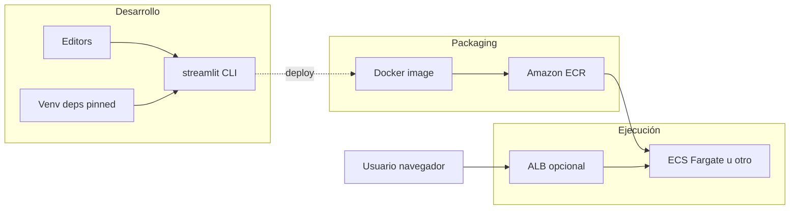

# Arquitectura técnica

## Diagrama de componentes (alto nivel)

## Stack

| Capa | Tecnología / artefactos |
|------|-------------------------|
| Runtime | Python (Dockerfile: `python:3.12-slim-bookworm`). |
| UI | Streamlit multipágina; entrada `app/Home.py`. |
| Branding / meta | `app/seed_main.py` (`configure_page`), tema `app/.streamlit/config.toml`. |
| Estilos | `app/styles/base.css` con prefijo `.seed-*`. |
| Contenedor | `Dockerfile`; `0.0.0.0:8501`; health `/_stcore/health`. |

## Estado y datos

Por defecto: `st.session_state` y demos de `cache_data` / `cache_resource`. Sin base de datos embebida.

## Infra declarada protegida

Lista maestra: `maintainers/seed-protected-paths.txt`. Validación en CI (GitLab) y opcionalmente `pre-commit` local.
